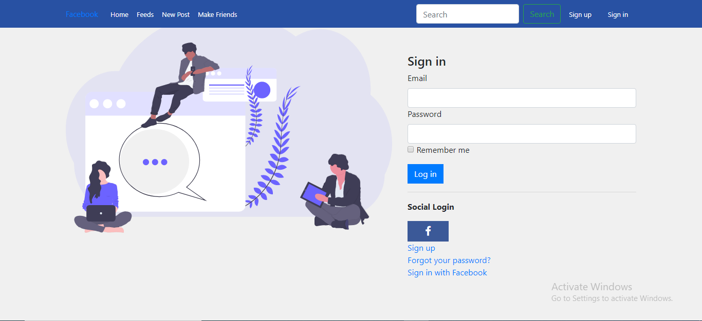
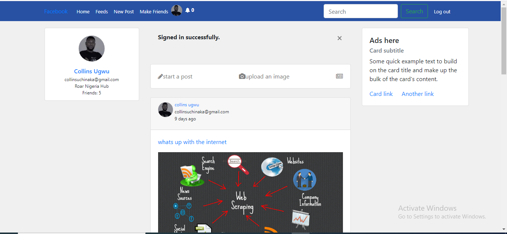

<!-- PROJECT SHIELDS -->
<!--
*** I'm using markdown "reference style" links for readability.
*** Reference links are enclosed in brackets [ ] instead of parentheses ( ).
*** See the bottom of this document for the declaration of the reference variables
*** for contributors-url, forks-url, etc. This is an optional, concise syntax you may use.
*** https://www.markdownguide.org/basic-syntax/#reference-style-links
-->
[![Contributors][contributors-shield]][contributors-url]
[![Forks][forks-shield]][forks-url]
[![Stargazers][stars-shield]][stars-url]
[![Issues][issues-shield]][issues-url]
[![MIT License][license-shield]][license-url]


<!-- PROJECT LOGO -->
<br />
<p align="center">
  <h3 align="center">Facebook Clone</h3>
  <p align="center">Link to life Version of the <a href="https://owl-social.herokuapp.com/">app</a></p>
  <p align="center">
  This app puts together some of the core features of facebook platform
    <br />
    <a href="https://github.com/abruzy/facebook-clone/blob/master/README.md"><strong>Explore the docs �</strong></a>
    <br />
    <br />
    <a href="https://www.theodinproject.com/courses/ruby-programming/lessons/advanced-building-blocks.">Assigment</a>
    �
    <a href="https://github.com/abruzy/facebook-clone/issues">Report Bug</a>
    �
    <a href="https://github.com/abruzy/facebook-clone/issues">Request Feature</a>
  </p>
</p>


<!-- TABLE OF CONTENTS -->
## Table of Contents

* [About the Project](#about-the-project)
  * [Built With](#built-with)
* [Getting Started](#getting-started)
  * [Prerequisites](#prerequisites)
  * [Installation](#installation)
* [Usage](#usage)
* [Roadmap](#roadmap)
* [Contributing](#contributing)
* [License](#license)
* [Contact](#contact)
* [Acknowledgements](#acknowledgements)


<!-- ABOUT THE PROJECT -->
## About The Project
<p>Sign In View</p>


<p>News Feeds View</p>

<!-- [![Product Name Screen Shot][product-screenshot]](https://example.com) -->

In this project, we'll put together some of the core features of the platform – users, profiles, “friending”, posts, news feed, and “liking”. we'll also implement sign-in with the real Facebook by using Omniauth and Devise.

### Built With
This progam was made using this technologies
* [Ruby](https://www.ruby-lang.org/en/)
* [Rails](https://rubyonrails.org/)
* [PostgreSQL](https://www.postgresql.org/)
* [Rubocop](https://github.com/rubocop-hq/rubocop)
* [Stickler](https://stickler-ci.com/)
* [Device-gem](https://github.com/heartcombo/devise)
* [Ominiauth](https://github.com/omniauth/omniauth)


<!-- GETTING STARTED -->
## Getting Started

To get a local copy up and running follow these simple example steps.

### Prerequisites

* Ruby
You can easily install Ruby on your Linux computer by using [Homebrew](https://docs.brew.sh/) and [Chruby](https://github.com/postmodern/chruby)
```sh
brew install chruby
brew install ruby-install
ruby-install ruby
```

* Rails
  You can easily install Rails by using [the odin project's giude](https://www.theodinproject.com/courses/web-development-101/lessons/your-facebook-clonelication) or directly from the [rails site](https://rubyonrails.org/)

```sh
  gem install rails
```

### Installation

<!-- 1. Get a free API Key at [https://example.com](https://example.com) -->
1. Clone the repo
```sh
git clone https://github.com/abruzy/facebook-clone
```


2. The next thing is to change directory folder

```sh
cd facebook-clone
```

3. The next step is to install our dependencies by running the following command below

```sh
bundle install
```

4. create a file called '.env' in your root directory and copy the field below and paste it inside that .env file

NB: please replace, for example 'yourpassword' to 'abruzy9463' with the appropiate details

```sh
POSTGRES_USER='yourpostgresuser'
POSTGRES_PASSWORD='yourpassword'
POSTGRES_HOST='yourpostgreshost'
POSTGRES_DB='yourdatabasename'
```
5. The next step is to run the command below

NB: please make sure you have pgadmin installed on your machine

```sh
rails db:create
```

6. The next step is to migrate to our database by running the following command

```sh
rails db:migrate
```

7. Voila!!, you did a great job but alas, we need to complete the whole step by actually starting our server by running the command below

```sh
rails s
```

8. Now to view the app, we need to visit this url below and you can actually see this in your terminal when you start the server

```sh
http://localhost:3000/
```

## To run test

```sh
rspec
```

<!-- USAGE EXAMPLES -->
## Usage
1. create, update, edit a user
2. create, update, edit and delete a feed
3. like and comment on a feed
4. send friend request
5. Recieve/Accept friend request
6. Sign up with devise gem
7. sign in with ominiauth

<!-- LIVE VERSION -->
## Live link
[facebook-clone](https://owl-social.herokuapp.com/)
<!-- ROADMAP -->
## Roadmap

See the [open issues](https://github.com/abruzy/facebook-clone/issues) for a list of proposed features (and known issues).


<!-- CONTRIBUTING -->
## Contributing

Contributions are what make the open source community such an amazing place to be learn, inspire, and create. Any contributions you make are **greatly appreciated**.

1. Fork the Project
2. Create your Feature Branch (`git checkout -b feature/AmazingFeature`)
3. Commit your Changes (`git commit -m 'Add some AmazingFeature'`)
4. Push to the Branch (`git push origin feature/AmazingFeature`)
5. Open a Pull Request


<!-- LICENSE -->
## License

Distributed under the MIT License. See `LICENSE` for more information.


<!-- CONTACT -->
## Contact


* Collins Ugwu: [Github](https://github.com/collinsugwu), [Twitter](https://twitter.com/collinsugwu_me)
* Abubarkar Diallo: [Github](https://github.com/abruzy)

Project Link: [https://github.com/abruzy/facebook-clone](https://github.com/abruzy/facebook-clone)

<!-- ACKNOWLEDGEMENTS -->
## Acknowledgements
* [Microverse](https://www.microverse.org/)
* [The Odin Project](https://www.theodinproject.com/)


<!-- MARKDOWN LINKS & IMAGES -->
<!-- https://www.markdownguide.org/basic-syntax/#reference-style-links -->
[contributors-shield]: https://img.shields.io/github/contributors/abruzy/facebook-clone
[contributors-url]: https://github.com/abruzy/facebook-clone/graphs/contributors
[forks-shield]: https://img.shields.io/github/forks/abruzy/facebook-clone
[forks-url]: https://github.com/abruzy/facebook-clone/network/members
[stars-shield]: https://img.shields.io/github/stars/abruzy/facebook-clone
[stars-url]: https://github.com/abruzy/facebook-clone/stargazers
[issues-shield]: https://img.shields.io/github/issues/abruzy/facebook-clone
[issues-url]: https://github.com/abruzy/facebook-clone/issues
[license-shield]: https://img.shields.io/github/license/abruzy/facebook-clone
[license-url]: https://github.com/abruzy/facebook-clone/blob/master/LICENSE.txt

